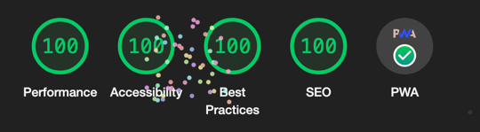

---

# Angular-Boilerplate
#### All in one Angular boilerplate.

### Awards
- 100 / 100 Lighthouse

### Integrations 
- TailwindCSS & Material cooperation
- Cordova ready
- Husky git management
- Git-flow management
- Eslint
- Prettier

### Abilities
- PWA
- Icons generator from svg
- Skip link
- Custom webpack
- App-shell
- Loader CSS (Before the boot for FCP)
- Login authentication
- Bundle compression
- Firebase deploy
- Check bundle size
- Index transform
- Log based on environment
- Cypress & e2e testing
- Local HTTP server ready

Git flow
---------------
